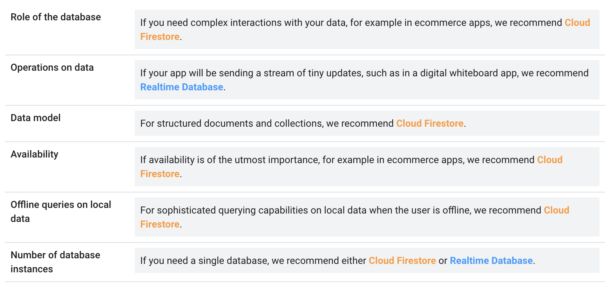
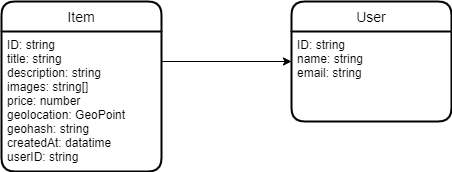

# Firebase

## Real-time database vs Firestore

**Firestore** seems to be the best fit because:
- allows to store collections on documents instead of only a single large JSON tree
- better offline capabilities
- is also real-time
- allows more advanced sorting (also [geo queries](#geo-queries))
- scales better (if we get millions of users)

https://firebase.google.com/docs/firestore/rtdb-vs-firestore

## How Firestore stores data
Firebase doesn't use a relational model, instead it only stores collections of documents.

A document is very similar to JSON object, it supports arrays, nested objects, numbers, strings [and more](https://firebase.google.com/docs/firestore/manage-data/data-types?hl=en).

## Queries possible with Firestore
- Get a single document using its ID
- Get all documents of a collection
  - where clause
  - order by clause

Useful conditions for the where clause:
- [whereIn](https://firebase.google.com/docs/firestore/query-data/queries?hl=en#in_not-in_and_array-contains-any) for example to get all items where the id is in the user's favorite list
- [whereArrayContains](https://firebase.google.com/docs/firestore/query-data/queries?hl=en#array_membership) for example if items have an array of tags/categories

Not a relational database so we cannot do joins, we have to manually fetch the referenced documents.

All queries can either
- be run once to get the data
- be "observed" and get notified in real time when a document matching the query changes (will be useful for the chat feature)

## Data model
We will have an `items` collection containing item documents with the attributes defined below.

In the future we will also have a `users` collection and each item will have the userID of its creator.

## Cache
Firestore caches automatically the accessed documents, we can continue to perform queries when offline and the cache will respond.
https://firebase.google.com/docs/firestore/manage-data/enable-offline?hl=en#kotlin+ktx

## Geo queries
Supports geo queries:
https://firebase.google.com/docs/firestore/solutions/geoqueries?hl=en#java
It will be useful when we integrate search of nearby items.

## Other Firebase features
- [Firebase Authentication](https://firebase.google.com/docs/auth?hl=en) to handle login with Google, Facebook, e-mail, phone number, etc...
- [Cloud Storage for Firebase](https://firebase.google.com/docs/storage?hl=en) to store images of items, profile pictures

## Useful references
- Videos explaining very well the concepts: [Get to know Cloud Firestore](https://www.youtube.com/playlist?list=PLl-K7zZEsYLluG5MCVEzXAQ7ACZBCuZgZ)
- [Firestore documentation](https://firebase.google.com/docs/firestore?hl=en)
